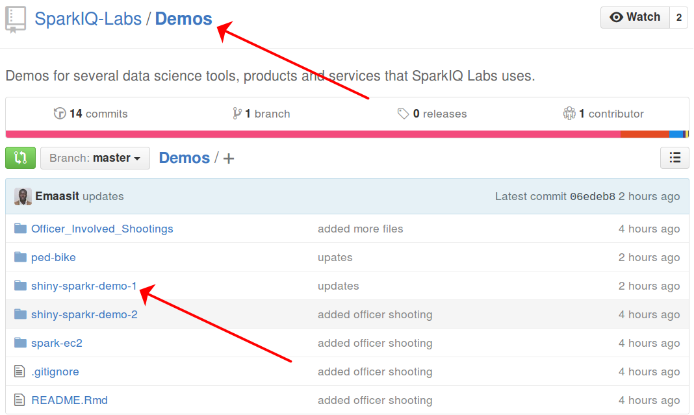
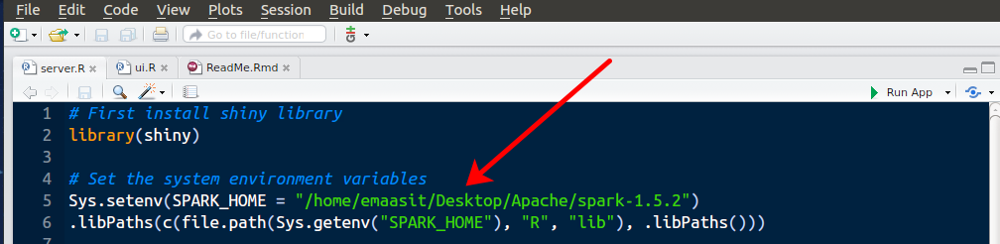
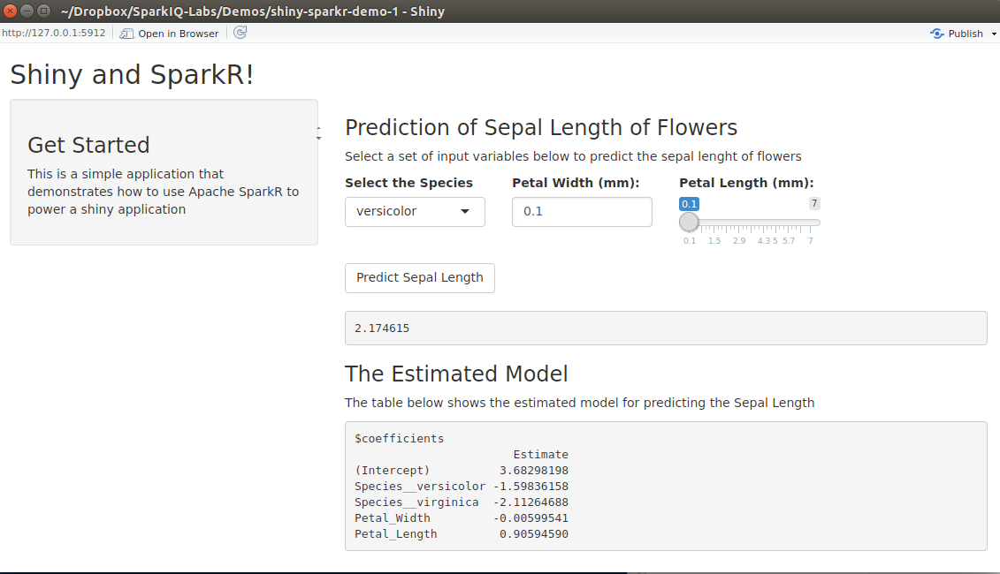
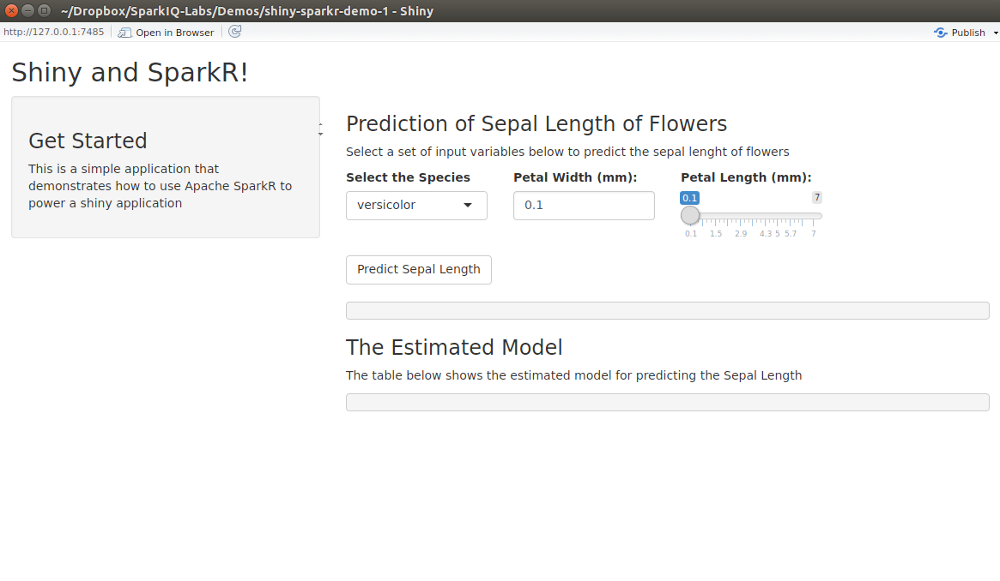
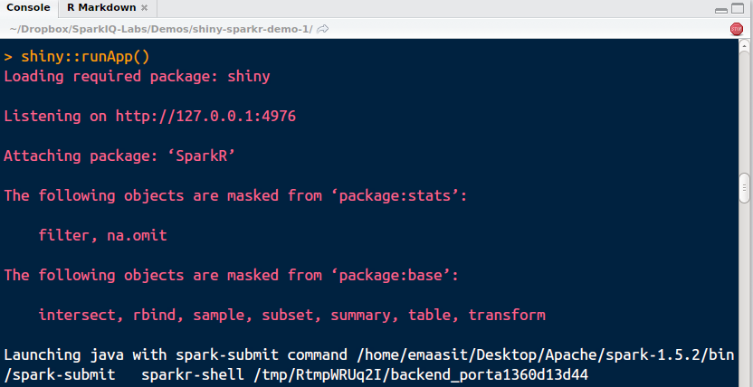
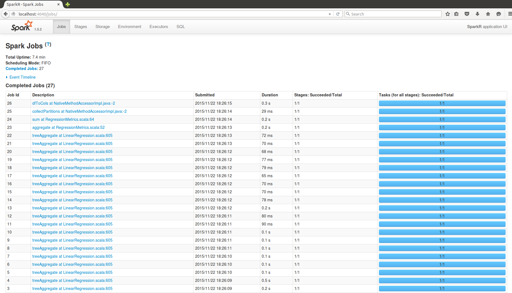
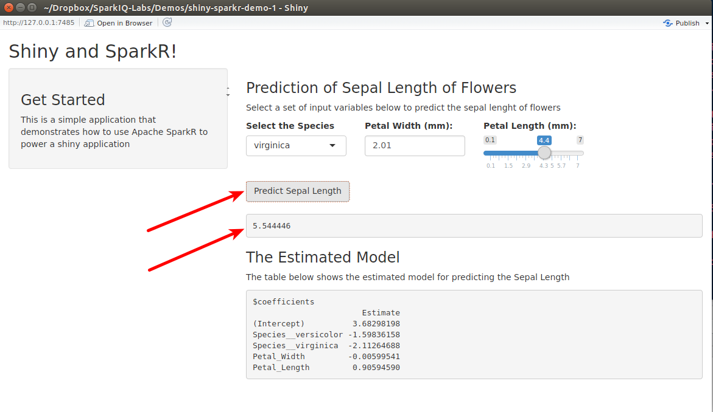

# Introduction

The objective of this document is demonstrate how to use [Apache SparkR](http://spark.apache.org) to power [Shiny application](http://shiny.rstudio.com).

**SparkR** is an R package that provides a light-weight frontend to use Apache Spark from R. SparkR provides a distributed data frame implementation that supports operations like selection, filtering, aggregation etc. (similar to R data frames, dplyr) but on large datasets. SparkR also supports distributed machine learning using MLlib. 

**Shiny** is an open source R package that provides an elegant and powerful web framework for building web applications using R. Shiny helps you turn your analyses into interactive web applications without requiring HTML, CSS, or JavaScript knowledge. 

# Uses Cases
So you're probabling asking yourself, why would I need to use SparkR to run my Shiny applications?. That is a legitimate question and to answer it, we need to understand the different classes of big data problems.

## Classes of Big Data Problems

In a recent [AMA on Reddit](http://bit.ly/1LbWPhl), [Hadley Wickham]((http://had.co.nz/)(Chief Scientist at [https://www.rstudio.com/](RStudio)) painted a clearer picture of how "Big Data" should be defined. His insights will help us to define uses cases for SparkR and Shiny.

I believe big data problems should be categrized in 3 main classes:

1. **Big Data-Small Analytics:** This is where a data scientist begins with a raw big dataset and then slices and dices that data to obtain the right sample required to answer a specific business/research problem. In most cases the resulting sample is a small dataset, which **doesnot** require SparkR to deploy a shiny application.

2. **Partition Aggregrate Analytics:** This is where a data scientist needs to distribute and parallelize computation over multiple machines. Wickham defines this problem as a **trivially parallelisable problem**. An example is when you need to fit one model per individual for thousands of individuals.  In this case SparkR is a good fit but there are also packages in R that solve this problem such as the [foreach package](https://cran.r-project.org/web/packages/foreach/index.html).

3. **Big Data-Large Scale Analytics**. This is where a data scientist needs all the big data, perhaps because you fitting a complex model. An example of this type of problem is recommender systems which really do benefit from lots of data because they need to recognise interactions that occur only rarely. SparkR is a perfect fit for this problem when developing Shiny applications.

## Memory Considerations

* If you are running your shiny applications on servers that have more than enough memory to fit your big data, then you probrably do not need SparkR. Now days there's accessibility to machines with terabytes on RAM from cloud providers like [Amazon AWS](http://aws.amazon.com).

* If your big data cannot fit on one machine, you may need to distribute it on several machines. SparkR is a perfect fit for this problem because it provides distributed algorithms that can crunch your data on different worker nodes and return the result to the master node.


# A Simple Illustrative Example
Before we start understanding how each piece of such an application would operate, let's download and run this simple Shiny-SparkR application. Go to this github repository <https://github.com/SparkIQ-Labs/Demos> and access the **"shiny-sparkr-demo-1"** example. 



## Prequisites
1. Make sure you already have Apache Spark 1.4.1 or later downloaded onto your computer. Instructions for downloading and starting SparkR can be found in this [blog post](http://bit.ly/1kP5Fbm).
2. Make sure you have Java 1.7.x installed and the environment variables are set.

## Launch the App
Once you have downloaded the app-folder, open the project in RStudio and open the **"server.R"** file.

1. **Change Spark Home**. Change the path of SPARK_HOME to point to where you installed Spark.



2. **Run the App**. Run the shiny app by using this command `shiny::runApp()`. It will take some time for SparkR to be initialized before you can see the results of the underlying analysis are displayed.



Here is the the code for the Server.R file.

```
# First install shiny library
library(shiny)

# Set the system environment variables
Sys.setenv(SPARK_HOME = "/home/emaasit/Desktop/Apache/spark-1.5.2")
.libPaths(c(file.path(Sys.getenv("SPARK_HOME"), "R", "lib"), .libPaths()))

#load the Sparkr library
library(SparkR)

# Create a spark context and a SQL context
sc <- sparkR.init(master = "local")
sqlContext <- sparkRSQL.init(sc)

#create a sparkR DataFrame for the "iris" dataset
iris_DF <- createDataFrame(sqlContext, iris)
cache(iris_DF)

# Define server logic required to predict the sepal length
shinyServer(function(input, output) {

  # Statistical machine learning
  
  model_fit <- glm(Sepal_Length ~ Species + Petal_Width + Petal_Length, data = iris_DF, family = "gaussian")
  
  output$summary_model <- renderPrint({summary(model_fit)})
  
  output$predict_new_value <- renderText({
    
    input$predictSepalLength
    
    isolate({
      Species <- as.character(input$species) 
      Petal_Width <- as.double(input$petalWidth)
      Petal_Length <- as.double(input$petalLength)
      
      
      
      new_data_frame <- data.frame(Species = Species, 
                                 Petal_Width = Petal_Width,
                                 Petal_Length = Petal_Length)
      
      newDataFrame <- createDataFrame(sqlContext, new_data_frame)
      
      predicted_value <- predict(model_fit, newData = newDataFrame)
      
      unlist(head(select(predicted_value, "prediction")))
    })
  })
  
  
})
```

# What happens Underneath.

1. **Stage 1:** When you run the app, the user interface is displayed but without the rendered text or model summary.



2. **Stage 2:** Meanwhile, in the background on your computer node(s), java is launched using the Spark-submit file, then the SparkR library is loaded and then SparkR is initialized.



3. **Stage 3:** SparkR commands in the Server.R file are then executed, which finally shows the output within the shiny app.


You can use the Spark UI to check the jobs that were completed, in the event timeline, to produce the final results in the shiny app. Go to localhost and listen on port 4040.



4. **Stage 4:** When you change the input values in the app and click the "Predict Sepal Length" button, the application uses the already exciting Spark Context to run the predict function and displays the predicted value. This operations takes a shorter time than the initial launch of the shiny app.



## Moving Forward
The objective of this first demo was to learn the use cases for SparkR and Shiny; and to see what happens underneath when you eventually deploy and run such an application on a PC.

In **Part II** of this tutorial, we shall see how to develop and deploy such an application for a "Big Data-Large Scale Analytics" problem on big data stored on multiple nodes of a cluster on AWS EC2. As we have already established this is one of the perfect use cases for SparkR and Shiny. 

